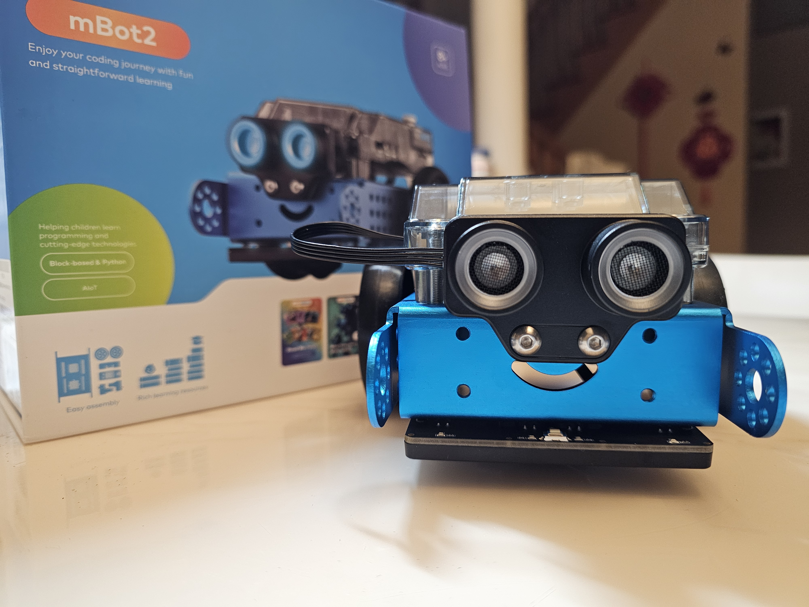

🛠️ [**Assembly Video**](https://github.com/user-attachments/assets/4b7b5236-4200-49d5-9852-447f6263da9d)

🎥 [**Action Video**](https://github.com/user-attachments/assets/7556d5a0-9dcc-4e69-a079-50024cef5ab0)

<strong>🧠 My Thinking</strong>

- I stop on red because it means danger.
- I slow down on yellow to be careful.
- I turn around on green to change direction.
- I speed up on blue to test fast movement.
- I use sleep() so actions can finish clearly.
- Next, I want to make the turns smoother.

